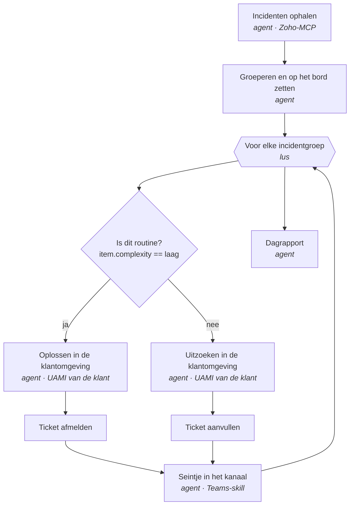

# Van melding tot afmelding, per klant

Incidenten uit Zoho worden per klant opgepakt in een eigen omgeving. Wat
routine is, wordt zelfstandig opgelost. Wat dat niet is, ligt uitgezocht klaar
voor een collega. Alles wat in de omgeving van een klant gebeurt, gebeurt onder
**hun eigen identiteit**.

## Het proces

| | Stap | Wat er gebeurt |
| --- | --- | --- |
| 01 | **Melding komt binnen** | Incidenten uit Zoho, elk uur. Meldingen die bij elkaar horen worden één zaak. |
| 02 | **Op het bord van de klant** | Elke zaak krijgt een ticket bij de juiste klant, met wat er al bekend is. |
| 03 | **Routine of uitzoekwerk?** | De agent weegt per zaak of dit zelfstandig af te handelen is. |
| 04a | **Zelf oplossen** | In de omgeving van de klant: pipeline herstarten, rechten rechtzetten, run overdoen. |
| 04b | **Uitzoeken en vastleggen** | Logs, runs en herkomst nalopen. Kijken, niet ingrijpen — dat blijft mensenwerk. |
| 05 | **Ticket bij, kanaal bij** | Opgelost: afgemeld met wat eraan gedaan is. Anders: klaargezet, met een seintje dat er iemand nodig is. |

Stap 3 tot en met 5 gebeuren **per zaak**, één voor één.

## Eén identiteit per klant

Elke klant heeft een eigen omgeving (een container) met een eigen
**user-assigned managed identity**. De twee stappen die in de omgeving van de
klant gebeuren — oplossen en uitzoeken — draaien onder die identiteit.

Wat dat oplevert:

- **Wij bewaren geen wachtwoorden.** De identiteit hangt aan de container, niet
  aan een sleutel die iemand moet bewaren, doorgeven of intrekken.
- **Bij de klant is te zien wie wat deed.** Elke actie in hun Fabric-omgeving
  staat op naam van hun eigen identiteit, niet op een gedeeld serviceaccount.
- **Een fout blijft binnen één klant.** Er is geen identiteit die bij twee
  klanten tegelijk naar binnen kan.

Zoho en het Teams-kanaal zijn van ons en draaien dus buiten de klantomgeving.
Die twee raken elkaar alleen via LabX.

## Wat de agent wel en niet zelf doet

**Wel:** het herkennen van bij elkaar horende meldingen, het onderzoeken van een
zaak, en het afhandelen van routinewerk in de omgeving van de klant.

**Niet:** beslissen dat iets geen routine is en het dan tóch doen. Wat
twijfelachtig is gaat uitgezocht en wel naar een collega — nooit half opgelost.

Per zaak blijft staan wat er is opgehaald, afgewogen en gedaan, inclusief wat
het kostte. Ook als er niemand meekeek.

---

# Hoe het in LabX gebouwd is

Dezelfde stroom, maar dan als workflow. Elke stap is een **activiteit**; LabX
voert ze één voor één uit en legt per activiteit vast wat het model kreeg, deed
en teruggaf.

## De activiteiten

| Activiteit | Soort | Levert op |
| --- | --- | --- |
| Incidenten ophalen | agent | `incidents[]` — klant, titel, tekst |
| Groeperen en op het bord zetten | agent | `incidentGroups[]` — klant, complexity, tickets[] |
| Voor elke incidentgroep | lus | loopt langs `stap.groeperen.json.incidentGroups` |
| Is dit routine? | als | `item.complexity == laag` → ja / nee |
| Oplossen in de klantomgeving | agent | in het lab van die klant |
| Uitzoeken in de klantomgeving | agent | lezen, niet ingrijpen |
| Ticket afmelden / aanvullen | agent | via de board-tools |
| Seintje in het kanaal | agent | Teams-skill, webhook uit de kluis |
| Dagrapport | agent | samenvatting na alle rondes |

Binnen de lus zijn `{{ item }}`, zijn velden (`{{ item.title }}`) en
`{{ iteratie }}` beschikbaar in élke activiteit — ook in de `als`. Elke ronde
begint met een schone kopie van wat er buiten de lus bekend is, zodat ronde 3
niet in ronde 4 lekt.

## Wat er per activiteit bewaard blijft

- De opdracht die het model kreeg
- Elke tool-aanroep onderweg
- Wat eruit kwam, en het gestructureerde resultaat
- Welke tak er genomen is, en bij een lus: welke ronde
- Duur, tokens en kosten

Handmatige en geplande runs komen in dezelfde geschiedenis terecht.

## Waar het stopt

- Een ronde die mislukt stopt de lus — of niet; dat is een keuze per lus.
- Een geheim dat niet bestaat stopt de aanroep, in plaats van `{{secret:…}}`
  letterlijk naar een externe dienst te sturen.
- Wat er uit een lab terugkomt gaat langs de data-guard voordat het model het
  ziet.

## Wat er nog niet is

Het koppelen van een lab aan een managed identity. Alle andere onderdelen zitten
in LabX v0.5.0: de lus met de `als`, uitvoerschema's die de keuzelijsten vullen,
de kluis met geheimen, en het verslag per activiteit.

Twee dingen om bij die koppeling te beslissen:

1. **Waar de identiteit vandaan komt.** Buiten Azure heeft een container geen
   metadata-endpoint om een token op te halen; op de huisserver moet dus iets
   anders de brug slaan.
2. **Lezen en schrijven scheiden.** Nu zou dezelfde identiteit zowel de
   uitzoek- als de oplostak bedienen. Met twee rollen (of twee identiteiten) is
   achteraf hard te maken dat de uitzoektak nooit iets heeft gewijzigd.
